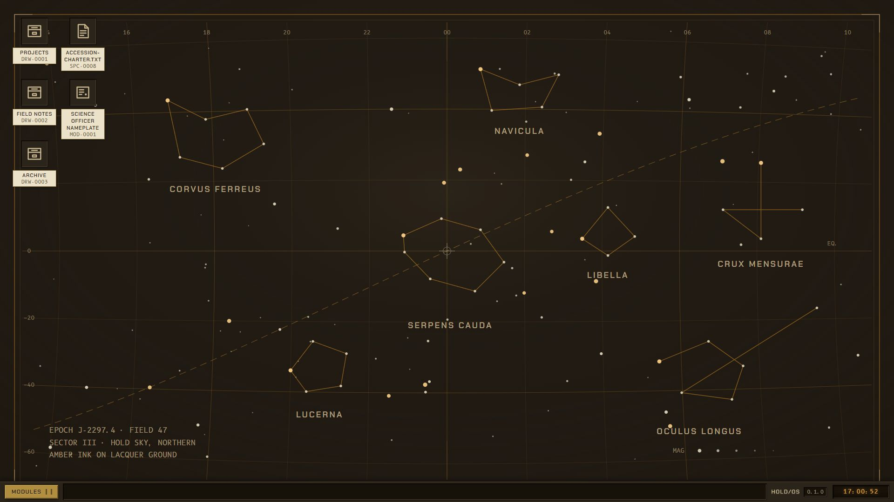
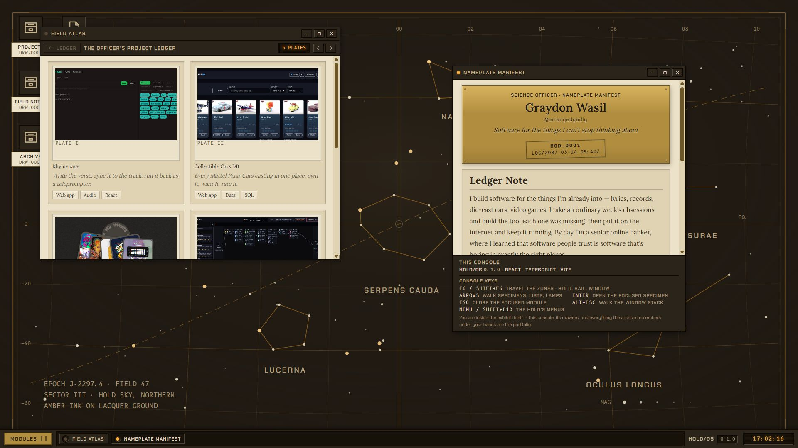
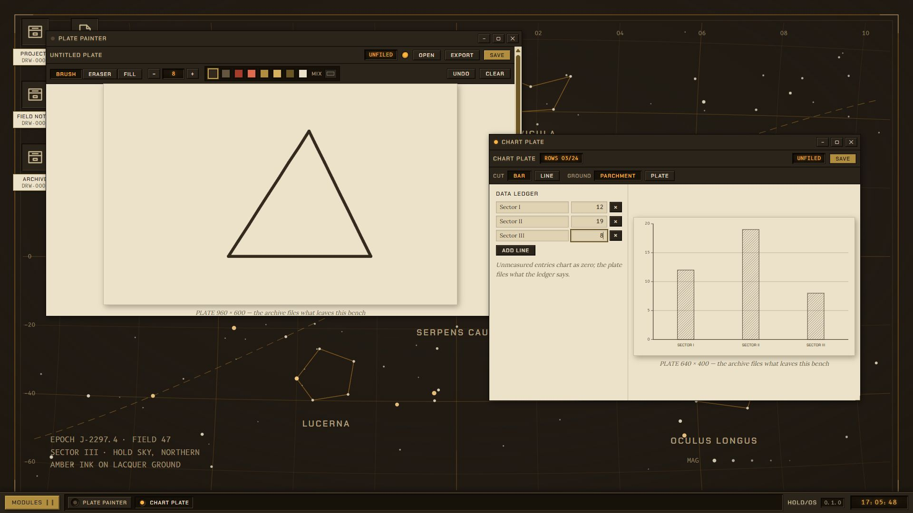
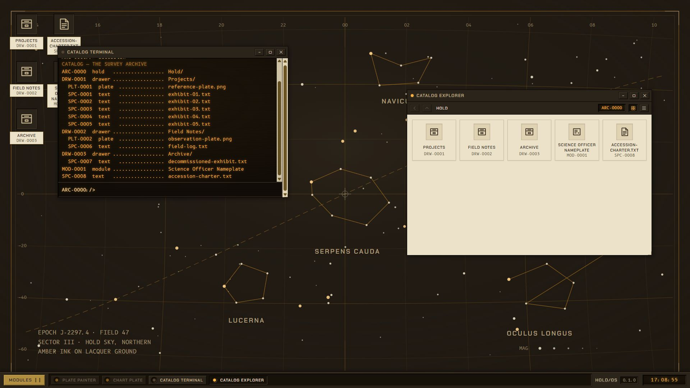

# HOLD/OS · The Survey Archive

**A playable portfolio disguised as a deep-space archive console.**

Boot the hold, open a drawer, write a field note, paint a specimen, or browse the officer’s projects. HOLD/OS runs a working desktop inside a browser tab: draggable icons, resizable windows, a shared virtual filesystem, and eighteen applications.

Warm black console chrome, parchment reading surfaces, amber displays, and brass controls give the archive its own visual world. The desktop is interactive, rather than a picture of an operating system.

[Take the tour](#a-three-minute-tour) · [Explore the modules](#eighteen-modules-one-archive) · [Run locally](#run-locally) · [Build an app](#extend-the-console)



*Captured from the running application in a fresh demonstration session.*

## A three-minute tour

1. **Boot the console.** The first visit plays a short startup sequence. Click or press a key to skip it.
2. **Open Field Atlas.** Browse the project plates, read their field notes, and follow a live-site or repository link when you want to leave the console.
3. **Make something.** Open Specimen Notepad or Plate Painter, give the work a name, and save it into the archive.
4. **Find it another way.** Open Catalog Explorer or use `ls`, `cat`, and `open` in Catalog Terminal. These apps share the same virtual files.
5. **Keep a copy.** Archive Backup exports a JSON snapshot you can restore later.

Use a desktop browser with a viewport at least 1024 pixels wide. Smaller screens show an intentional contact notice instead of squeezing the desktop into a phone layout.

## Working with the desktop

| Action | Control |
| --- | --- |
| Open a specimen or drawer | Double-click it, or focus it and press Enter |
| Arrange the desktop | Drag icons; drop a specimen onto a drawer to file it |
| Create a drawer or text specimen | Open the desktop context menu |
| Rename or delete a specimen | Open its context menu; deletion has a confirmation step |
| Move or resize a window | Drag its title bar or resize handles |
| Minimize, maximize, restore, close | Use the title-bar controls |
| Return to an open app | Use its taskbar LED; the active window can also be stowed there |
| Launch another module | Open the module drawer in the bottom rail |

Catalog Explorer adds Back, Up, breadcrumbs, and specimen-card or ledger views. Window state and archive files are separate: closing an editor is not the same as deleting its saved specimen.

## Eighteen modules, one archive

### Explore and record



| Module | What you can do |
| --- | --- |
| **Field Atlas** | Browse curated portfolio projects, read detail plates, and open external project/repository links |
| **Nameplate Manifest** | Read the officer’s bio, contact channels, and console keyboard legend |
| **Catalog Explorer** | Navigate drawers, switch views, and create, rename, or delete specimens |
| **Specimen Notepad** | Edit archive text, save a new named note, and reopen it through other apps |
| **Plate Viewer** | Inspect images with fit/1:1 modes, 25–400% zoom, and drag-to-pan |
| **Field Notes** | Read text specimens through a Markdown-subset renderer and browse its catalog |

Existing Notepad files autosave after a short editing debounce. New untitled drafts need a name to become files; Ctrl/Cmd+S saves. Closing with unsaved changes opens a keep-editing/discard guard.

Field Atlas is a curated project viewer, not a general web browser. Its external links leave the simulation.

### Make and calculate



| Module | What you can do |
| --- | --- |
| **Plate Painter** | Draw on a 960×600 canvas, erase or fill, choose colors and five brush sizes, undo up to 20 steps, save into the archive, or export PNG |
| **Chart Plate** | Enter up to 24 data rows, choose bar/line and parchment/dark styles, and save a 640×400 SVG image specimen |
| **Catalog Terminal** | Work with the virtual filesystem using a fixed command vocabulary, history, and tab completion |
| **Cursor** | Evaluate arithmetic expressions and print results onto a calculator tape |

Each Chart Plate save creates a new specimen. Its editor does not guard unsaved input on close, so save the plate before leaving.

The terminal understands `help`, `clear`, `pwd`, `ls`, `cd`, `cat`, `mkdir`, `touch`, `rm`, `accession`, and `open`. It cannot execute system commands or arbitrary code on your computer.



### Discover the hold

| Module | What you can do |
| --- | --- |
| **Specimen Survey** | Play a Minesweeper-like excavation game with reveal/pin controls, presets, and independent game windows |
| **Hold Vivarium** | Watch a Canvas 2D tank, drop nutrients, pause it, or use manual stepping with reduced motion |
| **Survey Relay** | Read authored fictional correspondence that arrives as visible session time accrues, then file letters as archive text |
| **Reliquary** | Orbit and zoom three procedural WebGL specimens; an engraved fallback appears if WebGL is unavailable |
| **Type Cabinet** | Explore the console’s three typefaces, shipped weights, and typographic rules |

Survey Relay is part of the fictional expedition. It is not an email connection. The initial archive mixes portfolio content with explicitly labelled placeholder specimens.

### Maintain your archive

| Module | What you can do |
| --- | --- |
| **Archive Backup** | Download a JSON snapshot, preview/validate an import, and restore it through a two-step confirmation |
| **Console Vitals** | Inspect browser-supported memory/storage/frame diagnostics and replay the boot ladder |
| **Console Settings** | Choose among four wallpapers, enable synthesized UI sounds, adjust reduced motion, inspect storage, or reset the archive |

Sounds start muted. Some Vitals readings, including heap and long-task information, depend on browser support.

## What survives a reload

HOLD/OS saves its versioned state in the current browser’s IndexedDB. The stored envelope includes the virtual filesystem, icon positions, window records and stacking, app-provided window state, wallpaper, sound/reduced-motion preferences, and dismissed hints.

| State | Persistence behavior |
| --- | --- |
| Saved files and drawer organization | Stored in the browser archive |
| Icon positions and open-window records | Normally restored from the saved envelope |
| Per-app details | Restored only when that app provides serializable window state |
| Vivarium tank | Starts fresh on reopening/reload |
| Reliquary camera/selection and Field Notes reading selection | Session-only |
| Cursor tape | Can survive reload while its window remains; closing discards it |

Storage writes are debounced, generally about 500 ms after store changes. If storage is unavailable, the console can continue in memory with a warning. Under quota pressure it retries without window records to preserve the catalog. Browser clearing or eviction can remove the archive.

**Export important work through Archive Backup.** A restore replaces the current archive and windows; it is not a merge. Console Settings’ guarded archive reset reseeds the initial state.

## Keyboard controls

| Keys | Action |
| --- | --- |
| F6 / Shift+F6 | Move between desktop, taskbar, and window focus zones |
| Arrow keys | Navigate the desktop icon grid or the focused list/menu |
| Enter | Open or activate the selected item |
| Menu / Shift+F10 | Open a desktop or specimen context menu |
| Alt+Esc / Alt+Shift+Esc | Cycle window focus |
| Esc | Dismiss or close, after the focused app’s own handling/guard |
| Ctrl/Cmd+S | Save in Notepad, Painter, or Chart Plate |
| F, +, − in Plate Viewer | Toggle fit/1:1 or change zoom |

Apps retain their own editing keys, and menus manage their own focus. Painting remains a pointer-driven drawing surface, with keyboard shortcuts for tools and commands. The complete map is in [docs/KEYBOARD.md](docs/KEYBOARD.md).

## Privacy and network behavior

The application has no account system, application backend, or analytics integration. Archive state is kept in the browser. Fonts are self-hosted, and additional app modules load from the same origin when needed.

This does not mean the browser makes no network requests after startup: lazy application chunks and other static assets still need to load. External project and contact links are user-initiated. Static hosting is separate from the archive’s local storage and has its own infrastructure behavior.

The repository includes privacy tests for same-origin asset loading and the original app workflow. Those tests are useful coverage, not a blanket claim that every interaction across all eighteen modules has been audited.

## Run locally

Use **Node.js 24+** for the full development/check workflow and a recent desktop browser. The complete toolchain has newer requirements than Vite alone, including direct execution of the TypeScript performance script.

```sh
git clone https://github.com/Arrangedgodly/desktop-sim.git
cd desktop-sim
npm ci
npm run dev
```

Open the URL Vite prints. For a production build and local preview:

```sh
npm run build
npm run preview
```

No application backend or application secret configuration is required for local use.

## Stack and architecture

| Layer | Implementation | Role |
| --- | --- | --- |
| App surfaces | React 19 and TypeScript 6 | Module views, controls, and typed app contracts |
| Build | Vite 8 | Local development, static production output, and lazy app chunks |
| Shared state | Zustand 5 | Filesystem, windows, and settings |
| Persistence | IndexedDB through idb-keyval | Versioned archive envelope and browser-local recovery |
| Interaction/rendering | Pointer Events, Canvas 2D, WebGL | Desktop gestures, drawing, simulations, and procedural specimens |
| Sound | Web Audio | Synthesized interface feedback |
| Verification | Vitest, Testing Library, Playwright, axe | Model/component checks, browser journeys, and accessibility checks |

Apps sit above a shared registry and window platform. That platform supplies window chrome, focus, stacking, dragging, taskbar integration, and error boundaries; apps can use the shared virtual filesystem and provide their own serializable state. High-frequency pointer movement uses refs/transforms, with committed gestures updating stores.

Typography uses locally hosted **Chakra Petch**, **Lora**, and **B612 Mono**. Their SIL Open Font License files are included with [the fonts](src/styles/fonts/); these font licenses do not establish a license for the entire application.

## Checks

| Command | What it checks |
| --- | --- |
| `npm run typecheck` | TypeScript across application, tests, and configuration |
| `npm run lint` | ESLint rules |
| `npm test` | Vitest model/component tests |
| `npm run perf` | Production build and configured asset-size budgets |
| `npm run check` | Typecheck, lint, unit/component tests, and performance budget checks |
| `npm run test:e2e` | Playwright browser journeys using its own server on port 5180 |

Install the browser once with `npx playwright install chromium`. The full documented check sequence is `npm run check && npm run test:e2e`. These are the repository’s verification commands, not a claim that they were freshly run while editing this README.

## Extend the console

Create an app under `src/apps/<id>/`, define its manifest, and register it in `src/apps/index.ts`. Keep the shared window/platform behavior in the platform rather than rebuilding it inside each app.

```ts
export const apps: readonly AppManifest[] = [notepadApp, /* existing apps */, yourApp]
```

An app surface can load lazily and fail into its own fault card. Reload restoration depends on implementing the appropriate state contract. Read [docs/APP-CONTRACT.md](docs/APP-CONTRACT.md) and the runtime [app-registry contract](src/platform/app-registry/contract.ts) before extending lifecycle or close behavior.

## Deployment

`npm run build` emits a static `dist/` bundle. The documented active publishing path is `npm run deploy`, which builds and uploads with Wrangler to Cloudflare Pages. Check the configured project and your account before publishing.

The [deployment notes](docs/DEPLOY.md) contain the operational checklist. They also retain older branch wording: the repository’s current default branch is **main**, not master.

## Documentation

| Document | Contents |
| --- | --- |
| [Testing](docs/TESTING.md) | Check matrix and coverage |
| [Keyboard map](docs/KEYBOARD.md) | Platform and per-app controls |
| [App contract](docs/APP-CONTRACT.md) | Manifests, lifecycle, and integration |
| [Deployment](docs/DEPLOY.md) | Publishing and post-deploy review |
| [Privacy notes](docs/privacy-note.md) | Earlier privacy review and implementation context |
